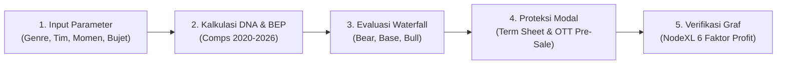

# 🎬 Indonesian Film Investment Intelligence & 🕯️ SANTET
### 2027 Movie Success Prediction & Nusantara Theatrical Expectation Tracking

<div align="center">

[](https://prediksi-movie-2027.streamlit.app)
[](https://github.com/indri007/prediksi-movie-2027)
[-blue)](data/film_master_2020_2026.csv)
[](https://prediksi-movie-2027.streamlit.app)
[](LICENSE)
[](docs/DESIGN.md#etika)

<br/>

### 🚀 **[Buka Live Simulator di Streamlit Cloud: prediksi-movie-2027.streamlit.app](https://prediksi-movie-2027.streamlit.app)**
*Konfigurasi Server Cloud: `prediksi-movie-2027 ∙ master ∙ streamlit_app.py`*

<br/>

<a href="https://prediksi-movie-2027.streamlit.app">
  
</a>

**"Membaca 'mantra' warganet & data historis industri sebelum layar bioskop menyala."**  
*Empirical Data · Theatrical Waterfall · Comparable DNA · Risk Mitigation · NodeXL Network Graph*

</div>

---

## 🌟 Apa yang Baru: Transformasi Platform Investasi Film 2027

Platform ini menggabungkan **data historis empiris 896 film Indonesia (2020–2026)** dengan metodologi finansial industri perfilman nasional:
1. **Master Database & Box Office Intelligence (2020–2026):**
   - **896 Film Master Dataset:** Mencakup 646 film dengan data tiket bioskop resmi dari seluruh rumah produksi besar (*MD Pictures, Falcon, Visinema, Starvision, Rapi, Imajinari, Soraya, Hitmaker, Dee Company, Screenplay, IDN Pictures*).
   - [**Top 50 Judul Film Revenue Tertinggi:**](data/top_50_highest_revenue_films_2020_2026.csv) 50 film berpendapatan kotor Rp 74,3 Miliar hingga Rp 522,5 Miliar.
   - [**50 Sutradara Terbaik Indonesia:**](data/top_50_directors_indonesia_2020_2026.csv) Profil lengkap sutradara dengan akumulasi penonton tertinggi beserta daftar prestasi dan piala (FFI, FFB, MURI).
   - [**Top 50 Produser Kredibel:**](data/top_50_producers_indonesia_2020_2026.csv) Peringkat produser dengan rekam jejak box office teruji.
   - [**Top 50 Artis Box Office:**](data/top_50_actors_indonesia_2020_2026.csv) Pemetaan bintang film pencetak tiket bioskop terbanyak.
   - [**10 Besar Genre & Market Fit:**](data/top_10_genres_market_fit.csv) Pangsa pasar bioskop (Horor 51,9%, Drama 36,2%, Komedi 7,2%, Animasi 3,4%).
2. **Simulator & Kalkulator Kelayakan Investasi ([Live Demo](https://prediksi-movie-2027.streamlit.app)):**
   - **Comparable DNA Matcher:** Mencocokkan rencana proyek 2027 dengan 5 film historis pembanding paling relevan.
   - **Multi-Scenario Audience Forecaster:** Skenario konservatif (**Bear** / P25), realistis (**Base** / Median), dan optimis (**Bull** / P75).
   - **Theatrical Waterfall Model:** Model bagi hasil bioskop nasional resmi (Gross $\to$ Pajak Pemda 10% $\to$ Exhibitor Split 50% $\to$ Net Produser $\approx 42,5\%$).
   - **BEP Admissions Sensitivity:** Menghitung jumlah minimal penonton untuk menutup biaya produksi dan promosi (P&A).
   - **Investor Risk Grade:** Klasifikasi kelayakan proyek (`AAA`, `AA`, `A`, `B`, `C`) dengan rekomendasi mitigasi modal.
3. **Model Graf Jaringan 6 Faktor Profit (NodeXL Architecture):**
   - Pemetaan hubungan terarah dan berbobot antara 6 pilar penentu profit: *Genre Fit*, *Cost Control*, *Distribution Timing*, *Initial Hook (IP & Cast)*, *Word-of-Mouth*, dan *Revenue Diversification* ([File NodeXL Graph](results/nodexl_profit_engine/)).
4. **Desain UI/UX Google Material Design 3 (Warna Cerah):**
   - Tampilan *light theme* modern, bersih, profesional, dan nyaman digunakan untuk presentasi komite investasi (*Investment Committee*).

---

## 📖 Petunjuk Penggunaan & Tutorial Guide (Step-by-Step)

Panduan lengkap ini menjelaskan cara menggunakan simulator di Streamlit Cloud maupun secara lokal untuk mengevaluasi rencana produksi film.

### 🧭 Alur Kerja 5 Langkah Simulasi Investasi Film



#### Langkah 1: Akses Aplikasi di Streamlit Cloud
1. Buka tautan resmi: **[prediksi-movie-2027.streamlit.app](https://prediksi-movie-2027.streamlit.app)**.
2. Aplikasi akan langsung membuka halaman utama: **`02_💰_Investasi_Film_2027` (Simulator Investasi Film 2027)**.
3. Jika menu navigasi tertutup, klik ikon panah di pojok kiri atas untuk membuka bilah samping (*Sidebar*).

#### Langkah 2: Masukkan Parameter Proyek Film 2027 (Sidebar Kiri)
Pada panel sebelah kiri, atur detail rencana proyek film Anda:
- **Judul Rencana Proyek:** Masukkan judul sementara proyek film (misal: *Misteri Pabrik Kuno*).
- **Genre Utama:** Pilih dari dropdown (rekomendasi komersial: *Horor*, *Komedi*, atau *Drama*).
- **Rumah Produksi (Studio):** Pilih studio produksi penggarap (misal: *MD Pictures*, *Visinema*, *Imajinari*, *Rapi Films*).
- **Produser Film:** Pilih dari **Top 50 Produser Kredibel** (misal: Manoj Punjabi, Ernest Prakasa, Dipa Andika).
- **Sutradara:** Pilih dari **50 Sutradara Terbaik Indonesia** (misal: Joko Anwar, Muhadkly Acho, Awi Suryadi, Kimo Stamboel).
- **Pemeran Utama (Lead Cast):** Pilih dari **Top 50 Artis Box Office** (misal: Vino G. Bastian, Reza Rahadian, Aghniny Haque, Indra Jegel).
- **Momen Rilis Bioskop 2027:** Tentukan jendela rilis (*Lebaran*, *Libur Akhir Tahun*, *Libur Sekolah*, *Kemerdekaan*, atau *Reguler*).
- **Tipe Cerita / Intellectual Property (IP):** Pilih asal mula materi cerita (*Thread Viral X/Twitter*, *Adaptasi Novel Bestseller*, *Sekuel/Waralaba*, atau *Ide Orisinal*).

#### Langkah 3: Tentukan Struktur Anggaran & Finansial
- **Anggaran Produksi (Miliar IDR):** Geser slider biaya produksi riil (standar film bioskop komersial berkisar antara **Rp 5 Miliar hingga Rp 15 Miliar**).
- **Rasio Biaya Promosi (P&A %):** Tentukan alokasi pemasaran (standar industri: **25% – 35%** dari biaya produksi).
- **Pre-Sale Hak OTT / Streaming (Miliar IDR):** Masukkan nominal komitmen awal lisensi streaming (*Netflix, Prime Video, Vidio*) jika sudah disepakati di muka.
- **Benchmark Harga Tiket / ATP (IDR):** Pilih rata-rata harga tiket nasional (rekomendasi: **Rp 50.000**).

#### Langkah 4: Evaluasi 4 Kartu Metrik Utama & Keputusan Kelayakan
Setelah parameter diatur, dashboard langsung menghitung metrik berikut secara *real-time*:
1. **🎯 BEP Penonton (Tiket Impas):** Berapa tiket bioskop yang wajib terjual agar seluruh pengeluaran (Produksi + P&A dikurangi Pre-Sale OTT) impas.
2. **📊 Proyeksi Penonton (Base Case):** Estimasi penonton realistis berbasis median performa film historis dengan DNA setara.
3. **💰 Estimasi Net ROI Produser:** Persentase imbal hasil bersih bagian produser terhadap total biaya proyek.
4. **🛡️ Investment Risk Grade:** Peringkat risiko proyek (`AAA` = Sangat Aman, `AA` = Aman, `A` = Layak, `B` = Waspada, `C` = Spekulatif) dengan rasio cakupan BEP.

#### Langkah 5: Eksplorasi 6 Tab Analisis Mendalam
Di bagian bawah metrik utama, telusuri 6 tab analisis komprehensif:
- **💵 Tab 1: Skenario Air Terjun Finansial (Theatrical Waterfall):**  
  Menampilkan tabel perbandingan 3 skenario:
  - **Bear Case (Konservatif / P25):** Skenario penonton minimal jika film mengalami persaingan ketat.
  - **Base Case (Realistis / Median):** Skenario paling mungkin terjadi berdasarkan DNA setara.
  - **Bull Case (Optimis / P75):** Skenario viralitas tinggi dan *word-of-mouth* masif.
- **🧬 Tab 2: DNA Film Pembanding (2020–2026):**  
  Melihat 5 film historis nyata yang paling mirip dengan rencana proyek Anda beserta tanggal rilis, genre, dan jumlah penonton aktual.
- **⚠️ Tab 3: Profil Risiko & Mitigasi:**  
  Menganalisis sensitivitas laba rugi jika terjadi penurunan penonton bioskop.
- **📑 Tab 4: Checklist Kontrak & Term Sheet:**  
  Panduan 4 klausul wajib pelindung modal investor (OTT Pre-Sale, Joint Escrow, Completion Bond Overrun Cap 10%, Blueprint Kampanye TikTok H-30).
- **🏆 Tab 5: Database Box Office:**  
  Database intelijen industri terlengkap dengan 5 sub-tab:
  1. *Top 50 Film Revenue Tertinggi (2020–2026)*
  2. *50 Sutradara Terbaik Indonesia & Prestasinya*
  3. *Top 50 Produser Paling Kredibel*
  4. *Top 50 Artis Box Office Terlaris*
  5. *10 Besar Genre & Market Fit*  
  *(Tersedia tombol unduh CSV di setiap sub-tab)*.
- **🕸️ Tab 6: Graf 6 Faktor Profit (NodeXL):**  
  Diagram interaktif dan tabel bobot keterhubungan antara 6 pilar profitabilitas tinggi (tersedia tombol unduh `vertices.csv`, `edges.csv`, dan `.graphml`).

---

## 🕸️ Graf Keterhubungan 6 Faktor Penentu Profit (Model NodeXL)

Berdasarkan arsitektur jaringan pada [NodeXL Graph Gallery](https://www.nodexlgraphgallery.org/), keuntungan tinggi perfilman Indonesia dibentuk oleh interaksi terarah antar faktor:

```mermaid
graph TD
    classDef factor fill:#e3f2fd,stroke:#1565c0,stroke-width:2px,color:#0d47a1;
    classDef lever fill:#fff3e0,stroke:#e65100,stroke-width:2px,color:#e65100;
    classDef goal fill:#e8f5e9,stroke:#2e7d32,stroke-width:3px,color:#1b5e20;

    F1["F1: Genre & Market Fit<br/>(Horor/Komedi/Drama)"]:::factor
    F2["F2: Cost Control<br/>(Bujet Produksi & P&A)"]:::factor
    F3["F3: Timing & Distribusi<br/>(Lebaran/Holiday vs Reguler)"]:::factor
    F4["F4: Hook (IP & Pemeran)<br/>(Viral IP / Ansambel Aktor)"]:::factor
    F5["F5: Kualitas Cerita & WoM<br/>(Buzz Organik & Plot Twist)"]:::factor
    F6["F6: Diversifikasi Revenue<br/>(OTT Pre-Sale, Brand, Int'l)"]:::factor

    L1["L1: Opening Weekend D1-D4<br/>(Okupansi Hari 1-4)"]:::lever
    L2["L2: Long-Tail Legs W2-W6<br/>(Daya Tahan Minggu 2-6)"]:::lever
    L3["L3: Ambang Titik Impas (BEP)<br/>(Target Minimal Penonton)"]:::lever
    L4["L4: Retensi Layar XXI/CGV<br/>(Showtime Preservation)"]:::lever
    L5["L5: Non-Theatrical Income<br/>(Arus Kas Non-Tiket)"]:::lever
    L6["L6: Net Producer Share<br/>(42.5% Box Office Bersih)"]:::lever

    GOAL["🎯 GOAL: Keuntungan Bersih & ROI Maksimal"]:::goal

    %% Hubungan Faktor -> Tuas Operasional (Edges)
    F4 -->|Bobot: +0.45 (Drive Early Demand)| L1
    F1 -->|Bobot: +0.30 (Market Depth Alignment)| L1
    F3 -->|Bobot: +0.25 (High Holiday Footfall)| L1

    F5 -->|Bobot: +0.60 (Organic Advocacy)| L2
    F1 -->|Bobot: +0.20 (Sustained Genre Craving)| L2

    F1 -->|Bobot: +0.25 (Screen Quota Priority)| L4
    L1 -->|Bobot: +0.50 (High Occupancy Triggers Screens)| L4
    L4 -->|Bobot: +0.40 (Enables Extended Run)| L2

    F2 -->|Bobot: -0.55 (Lean Budget Lowers Target)| L3
    F6 -->|Bobot: -0.35 (Pre-sale Offsets Budget)| L3

    F6 -->|Bobot: +0.60 (Streaming Rights & Brands)| L5

    L1 -->|Bobot: +0.35 (Volume Multiplier)| L6
    L2 -->|Bobot: +0.55 (Cumulative Box Office)| L6

    %% Muara Tuas -> Keuntungan Finansial
    L6 -->|Bobot: +0.50 (Primary Theatrical Revenue)| GOAL
    L5 -->|Bobot: +0.30 (Pure Margin Cushion)| GOAL
    L3 -->|Bobot: -0.40 (Low BEP Ensures Quick Profit)| GOAL
```

### Penjelasan 3 Rantai Nilai Ekonomi Graf:
1. **Rantai Nilai Traksi Awal:** $\text{F4 (Hook)} + \text{F1 (Genre)} + \text{F3 (Timing)} \to \text{L1 (Opening Weekend)} \to \text{L4 (Retensi Layar XXI)}$. Mengunci kuota jam tayang bioskop sebelum evaluasi Senin pertama.
2. **Rantai Nilai Daya Tahan (The Long-Tail Engine):** $\text{F5 (Kualitas Cerita)} \to \text{L2 (Word-of-Mouth Minggu 2–6)} \to \text{L6 (Akumulasi Box Office)}$. Mencegah penurunan drastis okupansi di minggu kedua.
3. **Rantai Perlindungan Modal (Capital Shield):** $\text{F2 (Cost Control)} + \text{F6 (OTT Pre-Sale)} \to \text{L3 (BEP Rendah)}$. Memastikan proyek sudah aman dan cepat mencapai titik untung bahkan pada skenario pasar moderat.

---

## 🛡️ 4 Pilar Perlindungan Modal Investor (Term Sheet Blueprint)

Untuk memitigasi risiko kegagalan komersial perfilman, terapkan 4 klausul baku ini dalam perjanjian investasi:
1. **Pre-Sale Hak OTT Streaming (25%–30% Biaya Proyek):**
   - Kunci kontrak lisensi penayangan digital di muka dengan platform SVOD (*Netflix, Prime Video, Vidio*) sebelum syuting dimulai guna mengamankan arus kas penutup biaya dasar.
2. **Klausul Completion Bond & Overrun Cap 10%:**
   - Rumah produksi wajib menanggung sendiri segala pembengkakan biaya (*budget overrun*) yang melampaui 10% dari rencana anggaran awal.
3. **Rekening Penampungan Bersama (Joint Escrow Account):**
   - Dana investasi dicairkan bertahap berdasarkan pencapaian fase (*milestone*): 30% Pra-produksi, 40% Produksi/Syuting, 20% Pasca-produksi/CGI, 10% Rilis Bioskop.
4. **Strategi Promosi Digital H-30 (TikTok & YouTube):**
   - Fokuskan promosi digital organik 30 hari sebelum rilis (H-30) menggunakan materi adegan emosional berdurasi pendek, reaksi penonton, dan konten di balik layar untuk memicu viralitas organik.

---

## 📊 Ringkasan Data Industri (2020–2026)

| Komponen Intelijen | Jumlah Rekor | Sumber & File Terkait |
|---|:---:|---|
| **Master Dataset Film Indonesia** | 896 Judul (646 Berpenonton) | [`data/film_master_2020_2026.csv`](data/film_master_2020_2026.csv) |
| **Top 50 Film Revenue Tertinggi** | 50 Judul (1,65M – 11,0M tiket) | [`data/top_50_highest_revenue_films_2020_2026.csv`](data/top_50_highest_revenue_films_2020_2026.csv) |
| **50 Sutradara Terbaik & Prestasi** | 50 Sutradara Terverifikasi | [`data/top_50_directors_indonesia_2020_2026.csv`](data/top_50_directors_indonesia_2020_2026.csv) |
| **Top 50 Produser Kredibel** | 50 Produser Terverifikasi | [`data/top_50_producers_indonesia_2020_2026.csv`](data/top_50_producers_indonesia_2020_2026.csv) |
| **Top 50 Artis Box Office** | 50 Aktor/Aktris Terverifikasi | [`data/top_50_actors_indonesia_2020_2026.csv`](data/top_50_actors_indonesia_2020_2026.csv) |
| **10 Besar Genre & Market Fit** | 10 Kategori Pasar | [`data/top_10_genres_market_fit.csv`](data/top_10_genres_market_fit.csv) |
| **Top 100 Investor Film Indonesia** | 100 Entitas & Tesis Investasi | [`data/top_100_film_investors_indonesia.csv`](data/top_100_film_investors_indonesia.csv) |
| **Paket Graf 6 Faktor Profit (NodeXL)** | Vertices, Edges, GraphML | [`results/nodexl_profit_engine/`](results/nodexl_profit_engine/) |
| **Paket Graf Festival & FFI (NodeXL)** | Vertices, Edges, GraphML | [`results/nodexl_festival_awards_engine/`](results/nodexl_festival_awards_engine/) |

---

## ⚡ Panduan Instalasi & Eksekusi Lokal (Developer Guide)

### 1. Kloning Repositori & Persiapan Environment
```bash
# Clone repository
git clone https://github.com/indri007/prediksi-movie-2027.git
cd prediksi-movie-2027

# Pasang dependensi ringan
pip install -r requirements.txt
```

### 2. Menjalankan Dashboard Streamlit
```bash
streamlit run streamlit_app.py
```
Aplikasi akan otomatis terbuka pada peramban web di alamat: `http://localhost:8501`.

### 3. Pembaruan Dataset & Eksekusi Pipeline (Opsional)
```bash
# Membangun ulang master dataset 2020-2026
python scripts/build_film_master_2020_2026.py

# Menjalankan evaluasi faktor komersial & DNA matcher
python scripts/analyze_investment_factors.py
```

---

## 📁 Struktur Direktori Repositori

```
prediksi-movie-2027/
├── streamlit_app.py                            # Entrypoint Streamlit Community Cloud (Router)
├── streamlit_app/
│   ├── pages/
│   │   ├── 02_💰_Investasi_Film_2027.py        # SIMULATOR UTAMA & DATABASE BOX OFFICE
│   │   └── 01_📖_Cerita.py                    # Cerita Riset SANTET & Metodologi Budaya
│   └── app.py                                  # Dashboard Analisis Jaringan (SNA)
├── src/
│   └── investment_engine_2027.py               # Core Investment Intelligence Engine
├── data/
│   ├── film_master_2020_2026.csv               # Master Dataset 896 Film Indonesia (2020-2026)
│   ├── top_50_highest_revenue_films_2020_2026.csv # 50 Film Pendapatan Tertinggi (2020-2026)
│   ├── top_50_directors_indonesia_2020_2026.csv   # 50 Sutradara Terbaik & Prestasinya
│   ├── top_50_producers_indonesia_2020_2026.csv   # Top 50 Produser Kredibel
│   ├── top_50_actors_indonesia_2020_2026.csv      # Top 50 Artis Box Office Terlaris
│   ├── top_10_genres_market_fit.csv               # 10 Besar Genre & Market Fit Pasar
│   ├── top_100_film_investors_indonesia.csv       # 100 Investor Film Indonesia & Tesis ROI
│   └── films_clean.csv                         # Dataset Verifikasi 15 Film Riset Baseline
├── results/
│   ├── nodexl_profit_engine/                   # Paket Graf Jaringan 6 Faktor Profit
│   │   ├── vertices.csv                        # Node/Vertices (Faktor, Tuas, Goal)
│   │   ├── edges.csv                           # Garis Relasi Terarah & Berbobot
│   │   └── profit_factors_network.graphml      # File GraphML Siap Impor ke NodeXL Pro
│   ├── nodexl_festival_awards_engine/          # Paket Graf Jaringan Festival & FFI Strategy
│   │   ├── vertices.csv                        # Node Ekosistem Global & Nasional
│   │   ├── edges.csv                           # Garis Lobi, Lab, dan Akademi Citra
│   │   └── festival_awards_network.graphml     # File GraphML Siap Impor ke NodeXL Pro
│   ├── investment_factor_summary.md            # Ringkasan Temuan Investasi
│   └── sna_*/                                  # Data Analisis Graf Louvain
├── requirements.txt                            # Dependensi Ringan Streamlit Cloud
└── requirements-pipeline.txt                   # Dependensi Penuh Machine Learning
```

---

## 📜 Kepatuhan Hukum, Privasi & Independensi

- **Independensi Riset:** Riset ini bersifat analitis independen dan tidak berafiliasi dengan studio film komersial manapun. Seluruh angka diolah dari data publik yang terpublikasi untuk keperluan studi, simulasi, dan edukasi perfilman.
- **Kepatuhan Privasi (UU PDP No. 27/2022):** Seluruh data interaksi warganet dipseudonimkan satu arah menggunakan enkripsi HMAC-SHA256 tanpa menyimpan teks mentah atau identitas pengguna asli.

---

<div align="center">
<sub>Indonesian Film Investment Intelligence Platform · Lisensi MIT · 2026</sub>
</div>
