# 🎬 Indonesian Film Investment Intelligence & 🕯️ SANTET
### 2027 Movie Success Prediction & Nusantara Theatrical Expectation Tracking

<div align="center">

[](https://prediksi-movie-2027.streamlit.app)
[](https://github.com/indri007/prediksi-movie-2027)
[-blue)](data/film_master_2020_2026.csv)
[](https://prediksi-movie-2027.streamlit.app)
[](LICENSE)
[](docs/DESIGN.md#etika)

<br/>

### 🚀 **[Buka Live Simulator di Streamlit Cloud: prediksi-movie-2027.streamlit.app](https://prediksi-movie-2027.streamlit.app)**
*Konfigurasi Cloud: `prediksi-movie-2027 ∙ master ∙ streamlit_app.py`*

<br/>

<a href="https://prediksi-movie-2027.streamlit.app">
  
</a>

**"Membaca 'mantra' warganet & data historis industri sebelum layar bioskop menyala."**  
*Empirical Data · Theatrical Waterfall · Comparable DNA · Risk Mitigation*

</div>

---

## 🌟 Apa yang Baru: Transformasi Platform Investasi Film 2027

Repositori ini telah dievolusikan dari riset eksploratif 15 film menjadi **Platform Intelijen Investasi Perfilman Indonesia**:
1. **Master Dataset Industri 2020–2026 ($N = 896$ Film):**
   - Mengumpulkan seluruh film Indonesia dari 2020 hingga 2026 dengan **646 film bertiket bioskop resmi**.
   - Menyelesaikan *sample constraint* sebelumnya dan mencakup seluruh studio besar (*MD Pictures, Falcon, Visinema, Starvision, Rapi, Imajinari, Soraya, Hitmaker, Dee Company, Screenplay, IDN Pictures*).
2. **Simulator & Kalkulator Kelayakan Investasi Film 2027 ([Live Demo](https://prediksi-movie-2027.streamlit.app)):**
   - **Comparable DNA Matcher:** Mencocokkan rencana proyek 2027 dengan 5 film historis 2020–2026 yang paling relevan.
   - **Multi-Scenario Audience Forecaster:** Skenario penonton konservatif (**Bear** / P25), realistis (**Base** / Median), dan optimis (**Bull** / P75).
   - **Theatrical Waterfall Model:** Model pembagian hasil bioskop nasional (Gross $\to$ Pajak Pemda 10% $\to$ Exhibitor Split 50% $\to$ Net Bagian Produser $\approx 42,5\%$).
   - **BEP Admissions Sensitivity:** Menghitung jumlah minimal tiket yang harus terjual untuk menutup bujet produksi dan promosi (P&A).
   - **Investor Risk Grade:** Klasifikasi kelayakan proyek (`AAA`, `AA`, `A`, `B`, `C`) dengan rekomendasi mitigasi modal.
3. **Modul Dasar Riset SANTET Tetap Utuh:**
   - Analisis sentimen trailer YouTube sadar konteks budaya nusantara (*"merinding" & "serem" sebagai pujian/demand*).
   - 20 fungsi Social Network Analysis (SNA / NodeXL) interaktif.
   - Kepatuhan privasi penuh sesuai UU PDP No. 27/2022 (pseudonimisasi satu arah HMAC-SHA256).

---

## 📊 Status Data & Pemodelan (Update Terbaru)

| Komponen | Status | Keterangan / Hasil Aktual |
|---|:---:|---|
| **Master Dataset Industri (2020–2026)** | ✅ | **896 film unik** ([`data/film_master_2020_2026.csv`](data/film_master_2020_2026.csv)), 646 dengan data penonton resmi |
| **Top 50 Produser Kredibel (2020–2026)** | ✅ | **50 produser terverifikasi** ([`data/top_50_producers_indonesia_2020_2026.csv`](data/top_50_producers_indonesia_2020_2026.csv)) dengan rekam jejak box office |
| **Top 50 Artis Box Office (2020–2026)** | ✅ | **50 pemeran teratas** ([`data/top_50_actors_indonesia_2020_2026.csv`](data/top_50_actors_indonesia_2020_2026.csv)) pencetak penonton bioskop tertinggi |
| **Simulator Investasi 2027 (Streamlit)** | ✅ | Live di [`prediksi-movie-2027.streamlit.app`](https://prediksi-movie-2027.streamlit.app) |
| **Model Air Terjun Finansial (Waterfall)** | ✅ | Standar industri bioskop Indonesia (Net Produser $\approx 42,5\%$ Gross) |
| **Checklist Proteksi Modal & Term Sheet** | ✅ | Pre-sale OTT, Joint Escrow, Overrun Cap 10%, H-30 TikTok Blueprint |
| **Analisis Faktor Komersial (EDA)** | ✅ | Laporan faktor di [`results/investment_factor_summary.md`](results/investment_factor_summary.md) |
| **Sinyal YouTube Trailer Terverifikasi** | ✅ | 40 trailer resmi, 9.840 komentar terlabeli tanpa teks mentah |
| **Korelasi Spearman Empiris** | ✅ | $\rho = 0,571$, $p = 0,026$ (*likes YouTube vs penonton bioskop*) |
| **Analisis Graf SNA (NodeXL / Louvain)** | ✅ | 20 analisis jaringan, $Q = 0,810$ (13 komunitas) |
| **Disiplin Data Tanpa Halusinasi** | ✅ | Variabel biaya tertutup ditandai strictly `NULL` (tidak dikarang model) |

---

## 🏛️ Arsitektur Disiplin 3-Tier Data

Untuk menjaga kredibilitas analisis di hadapan investor dan komite pembiayaan film:
- **Tier A — Actual Data (Faktual Terverifikasi):**  
  Data publik resmi yang dapat diverifikasi: Judul, Tanggal Rilis, Tahun, Genre, Sutradara, Cast, Studio (PH), dan Penonton Bioskop Resmi.
- **Tier B — Derived Data (Metrik Terhitung):**  
  Data turunan hasil kalkulasi objektif: *Estimated Gross Box Office (IDR)*, *Net Producer Ticket Share (IDR)*, *Commercial Tier* (Mega-Hit, Hit, Moderate, Underperformer), *Director Track Record*, dan *Studio Market Tier*.
- **Tier C — Missing Data (Strictly NULL / NaN):**  
  Variabel privat industri (*Production Budget*, *Marketing Spend*, *Actual Profit*, *OTT License Fee*). **Model ML dilarang mengarang angka kategori C**, melainkan disimulasikan secara transparan melalui *BEP Sensitivity Analysis*.

---

## 🎬 Top 10 Film Terlaris Indonesia 2020–2026 dalam Dataset

| Tahun | Judul Film | Genre | Sutradara | Production House | Penonton | Est. Gross Box Office (IDR) |
|:---:|---|:---:|---|---|---:|---:|
| 2025 | **Agak Laen: Menyala Pantiku** | Komedi | Muhadkly Acho | Imajinari | 11.000.866 | Rp 522,5 Miliar |
| 2025 | **Jumbo** | Animasi Fantasi | Ryan Adriandhy | Visinema Studios | 10.182.536 | Rp 483,6 Miliar |
| 2022 | **KKN di Desa Penari** | Horor | Awi Suryadi | MD Pictures | 9.233.847 | Rp 387,8 Miliar |
| 2024 | **Agak Laen** | Horor, Komedi | Muhadkly Acho | Imajinari | 9.125.188 | Rp 410,6 Miliar |
| 2022 | **Pengabdi Setan 2: Communion** | Horor | Joko Anwar | Rapi Films | 6.391.982 | Rp 268,4 Miliar |
| 2022 | **Miracle in Cell No. 7** | Drama | Hanung Bramantyo | Falcon Pictures | 5.851.595 | Rp 245,7 Miliar |
| 2024 | **Vina: Sebelum 7 Hari** | Horor | Anggy Umbara | Dee Company | 5.815.492 | Rp 261,6 Miliar |
| 2023 | **Sewu Dino** | Horor | Kimo Stamboel | MD Pictures | 4.886.406 | Rp 219,8 Miliar |
| 2025 | **Pabrik Gula** | Horor | Awi Suryadi | MD Pictures | 4.726.760 | Rp 224,5 Miliar |
| 2024 | **Kang Mak from Pee Mak** | Horor, Komedi | Herwin Novianto | Falcon Pictures | 4.580.209 | Rp 206,1 Miliar |

---

## ⚡ Quick Start

### 1. Menjalankan Dashboard Simulator secara Lokal
```bash
# Clone repository
git clone https://github.com/indri007/prediksi-movie-2027.git
cd prediksi-movie-2027

# Pasang dependensi ringan
pip install -r requirements.txt

# Jalankan Streamlit
streamlit run streamlit_app.py
```

### 2. Memperbarui Master Dataset & Analisis
```bash
# Update dataset 896 film 2020-2026
python scripts/build_film_master_2020_2026.py

# Jalankan analisis faktor investasi
python scripts/analyze_investment_factors.py
```

---

## 📁 Struktur Repositori

```
├── streamlit_app.py                            # Entrypoint Streamlit Cloud (Router Navigasi)
├── streamlit_app/
│   ├── pages/
│   │   ├── 02_💰_Investasi_Film_2027.py        # SIMULATOR INVESTASI FILM 2027 (BARU)
│   │   └── 01_📖_Cerita.py                    # Cerita Riset SANTET
│   └── app.py                                  # Dashboard Analisis Jaringan (SNA)
├── src/
│   └── investment_engine_2027.py               # Core Investment & Comparable DNA Engine
├── data/
│   ├── film_master_2020_2026.csv               # Master Dataset 896 Film Indonesia (2020-2026)
│   ├── films_clean.csv                         # Dataset Verifikasi 15 Film Riset Baseline
│   └── box_office_sources.csv                  # Log Audit Sumber Penonton
├── scripts/
│   ├── build_film_master_2020_2026.py          # Ingestion Pipeline 2020-2026
│   └── analyze_investment_factors.py           # Evaluasi Faktor Komersial
├── results/
│   ├── investment_factor_summary.md            # Laporan Temuan Faktor Investasi
│   ├── investment_factor_analysis.json         # Data JSON Agregat Faktor
│   └── sna_*/                                  # Output 20 Analisis Graf SNA
├── requirements.txt                            # Dependensi Ringan Streamlit Cloud
└── requirements-pipeline.txt                   # Dependensi Lengkap Machine Learning
```

---

## 📜 Kepatuhan Hukum, Privasi & Independensi

- **Independensi Riset:** Riset ini independen dan tidak berafiliasi resmi dengan studio film komersial manapun. Seluruh data dikutip dari sumber publik terpublikasi untuk tujuan edukasi dan analitik.
- **UU PDP No. 27/2022:** Seluruh identitas akun komentator YouTube dipseudonimkan satu arah (HMAC-SHA256). Teks mentah dan ID pengguna tidak disertakan dalam rilis publik.

---

<div align="center">
<sub>Indonesian Film Investment Intelligence Platform · MIT License · 2026</sub>
</div>
